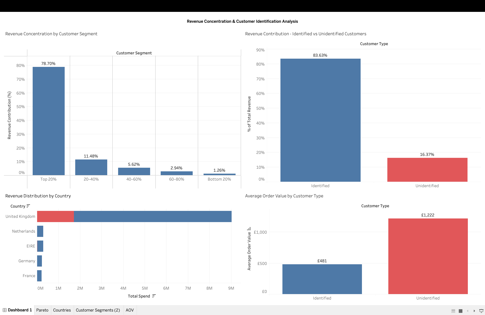

# E-COMMERCE REVENUE OPTIMIZATION & CUSTOMER CONCENTRATION ANALYSIS

## Project Background & Overview:
The company in hand is a UK based non-store online retail business that sells unique all-occasion gifts.
The project analyses transaction level data of the company using a dataset that contains over 500,000 records of transactions over a one-year period from December 2010 to December 2011. 
Insights and recommendations are provided across the following key areas: 
- **Revenue drivers**: Evaluation of overall revenue, order volumes and AOVs through transactions that contribute to revenue generation.
- **Revenue concentration**: Assessment of how revenue is distributed across customers using Pareto analysis.
- **Revenue Leakage**: Analysis of returns to identify revenue loss.
- **Unidentified Customers**: Examination of transactions without customer identification. 
## Tech Stack:
Tools: SQL (MySQL), Tableau

[View Live Tableau Dashboard Here](https://public.tableau.com/views/Project1-EcommerceDashboard/Dashboard1?:language=en-GB&:sid=&:redirect=auth&:display_count=n&:origin=viz_share_link)
## Data Structure & Cleaning: 
### Dataset Overview:
- Total rows: 541,909 
- Total Orders: 25,900
- Number of Customers: 4,372
- Countries: 38
### Key Data Issues Identified:
- Missing CustomerIDs (unidentified customers)
- Negative quantities (returns)
- Cancellation invoices (InvoiceNo starting with ‘C’)
- Partial returns not marked as cancellations
- Zero-value transactions (UnitPrice = 0)
- Adjustment and bad debt entries
  
### Data Cleaning Approach:
To ensure accurate analysis, a cleaned dataset view was created by:
- Removing returns and cancellations
- Excluding zero-value and adjustment transactions
- Retaining only valid revenue-generating purchases
  
Customer-level analysis was performed separately using only records with valid CustomerIDs.
## Executive Summary:
The business is primarily driven by repeat customers, with an average of around **4.3 orders per customer**. Revenue exhibits a Pareto-like distribution, with the **top 20% of customers contributing to about 75% of the total revenue**, indicating a heavy reliance on a small segment of high value customers.

A key observation is that around **16% of total revenue comes from unidentified customers**, who exhibit significantly **higher average order values, almost 2.5 times higher**, indicating that many high-value transactions are not being captured for retention or targeted engagement.

Additionally, the business observes a **return rate of about 8.4%**, representing moderate revenue leakage.

Overall, while the business demonstrates strong repeat purchasing behaviour, there are clear opportunities to improve customer identification and reduce revenue loss from returns.
## Insights Deep Dive:

### Revenue Overview:
**Key Metrics:**

- Total revenue generated: £10.65M
- Total number of customers: 4,338
- Total number of orders: 19,959
- Average Order Value: £533.88
- Revenue from **unidentified customers**: £1,744,214.6 
  - 16% of total revenue
  -	AOV: £1222.3 **(≈150% more than AOV of identified customers)**
  
**Insights:**
- Revenue is driven by a high volume of low-to-moderate value transactions but is **disproportionately influenced by a small segment of high-value orders**.
- A significant portion of high value transactions originates from unidentified customers, limiting the business’s ability to retain and engage its most valuable customers.
### Customer Behaviour: 
**Key Metrics:**

Average orders per customer: ≈4.2

Average revenue per customer: ≈£2,054

**Insights:**
- Customers tend to make repeat purchases over time, indicating strong retention potential.

### Revenue Concentration:
**Key Metrics:**

Top 20% customers – contribute to about 75% of total revenue.

Top 10 customers alone contribute about 15% of total revenue. 

**Insights:**

- Revenue is highly concentrated among a small portion of high value customers, which signal **high dependency on a small segment of customers**, and increased risk of losing a significant amount of revenue, should any such customers stop purchasing.
- A 10% reduction in spending from the top 10 customers would result in an approximate **£153K revenue impact**.

### Returns & Revenue Leakage
**Key Metrics:**

Total Returns: ≈£896K

Percentage of revenue lost: ≈8.4%
**Insights:**

- A meaningful portion of revenue is reversed due to returns, representing a significant revenue leakage, and indicating possible quality issues or order errors.
## Business Recommendations:
Based on all the insights so far, the following recommendations have been provided:
- **Improve Customer Identification:** About 16% of the revenue comes from unidentified customers, who also have significantly higher order values. **Improving customer identification** through mechanisms such as mandating registration before check-out or incentivizing account creation, can **enable engagement and retention**, and also offer options such as **targeted marketing** towards such high value customers.
   
- **Focus on High-Value Customers:** With the top 20% of customers contributing to about 75% of total revenue, **targeted retention strategies** such as loyalty programs, personalized offers and incentives can help **protect and grow this key segment**. 
At the same time, the company should focus on **growing and nurturing its lower-value customer base** to diversify revenue streams and **reduce concentration risk** and build a more stable and diversified revenue model.

- **Reduce Return Rates:** With about **8.4% of revenue lost due to returns**, the business should **investigate products with a high return rate**, eliminate reasons for such returns, improve quality control and manage customer expectations. 

## Limitations:
- This analysis is based on transaction level sales data without additional information on elements like  product categories or customer demographics.
- Returns are identified only through negative quantities, without detailed classification of return reasons, making it difficult to pinpoint the exact causes of revenue leakage.
## Next Steps:
With access to additional data and resources, further analysis could be conducted to deepen business insights.
-  **Product-Level Analysis:** Identify products with high return rates to isolate quality or fulfillment issues contributing to revenue leakage.
-  **Geographic Analysis:** Explore country-level trends to identify key markets and regional performance differences.
-  **Customer Identification Strategy Impact:** Simulate potential improvements in business growth by converting unidentified high-value transactions into trackable customer profiles.

